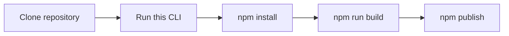

# @forsakringskassan/openapi-node-client-generator-cli

Wraps [Openapi Generator CLI](https://github.com/OpenAPITools/openapi-generator/). Generates an opinionated, minimal config, client NPM package, given an OpenAPI spec.

## Usage

It requires an `openapi.yaml` specification file on the filesystem. Run it with:

```sh
npx @forsakringskassan/openapi-node-client-generator-cli@latest \
 --package-name $(basename "$PWD") \
 --package-version $(npx git-changelog-command-line --print-next-version)
```

This will create a complete NPM package ready to be built and published. So that you only need to have the `openapi.yaml` spec in your version control system.

See example: https://github.com/Forsakringskassan/template-api

A typical pipeline building such a repository might look something like:



## Options

The CLI has these options:

```sh
      --version            Show version number                         [boolean]
      --package-name                                         [string] [required]
      --package-version                                      [string] [required]
      --openapi-spec-file                     [string] [default: "openapi.yaml"]
      --dry-run                                       [boolean] [default: false]
  -h, --help               Show help                                   [boolean]
```